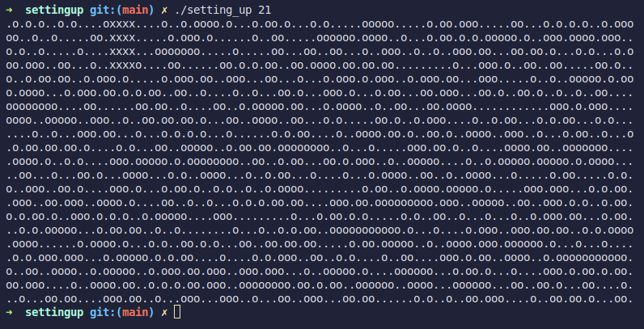
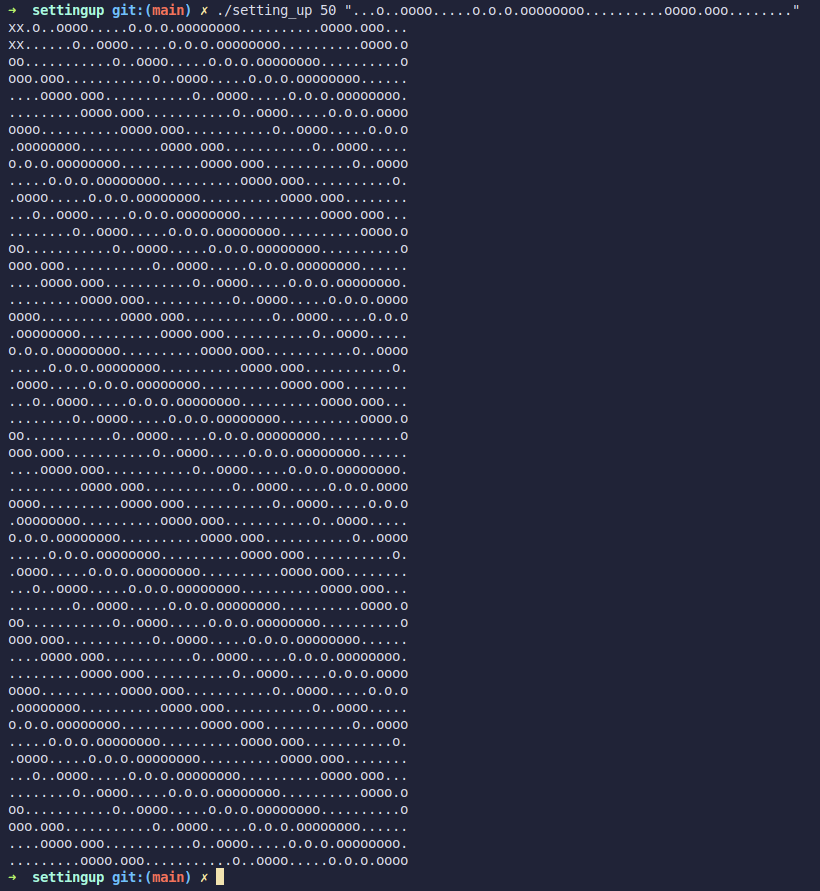

# Setting Up

## 🗺️ Project Overview

**Setting Up** is the second project of my first year after the C pool.  
The objective was to create a program, fully developed in C, that finds the largest possible square within a map, avoiding obstacles.  
If no map is provided, the program can generate a random one based on a given size and pattern.

- `.` (dot) represents free spaces
- `o` (letter o) represents obstacles

---

## 🚀 How to Use

### Compilation

To compile the project, simply run the following command using the provided **Makefile**.

### Running

You have two ways to run the program:

1. **Using a map file**:  
   You can provide a map file that contains the layout you want to solve.

2. **Generating a random map**:  
   You can generate a random map by specifying the size and pattern of the map.

---

## 🖼️ Example Screenshots

Here are some example outputs:

### With map file input

### With generated map

---
